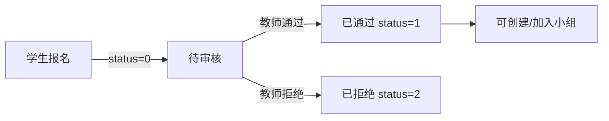

# 学生社会实践管理系统 - 项目总结文档

## 📋 文档导航

本项目包含以下完整文档：

| 文档名称 | 说明 | 路径 |
|---------|------|------|
| **README.md** | 项目概述、快速开始、技术栈介绍 | [README.md](README.md) |
| **USER_GUIDE.md** | 用户使用手册（管理员/教师/学生） | [USER_GUIDE.md](USER_GUIDE.md) |
| **DATABASE_GUIDE.md** | 数据库设计文档、表结构说明 | [DATABASE_GUIDE.md](DATABASE_GUIDE.md) |
| **API.md** | API接口文档 | [API.md](API.md) |
| **DEPLOYMENT.md** | 部署指南 | [DEPLOYMENT.md](DEPLOYMENT.md) |
| **CHANGELOG.md** | 版本更新日志 | [CHANGELOG.md](CHANGELOG.md) |
| **PROJECT_REPORT.md** | 项目报告 | [PROJECT_REPORT.md](PROJECT_REPORT.md) |

---

## 🎯 项目概述

### 项目名称
学生社会实践管理系统 (Student Social Practice Management System)

### 项目简介
基于SSM框架开发的Web应用系统，为高校社会实践活动提供全流程信息化管理，支持管理员、教师、学生三种角色的协同工作。

### 开发周期
2024年12月 - 2024年12月（V2.0版本）

### 项目规模
- **代码行数**: 约15,000行
- **数据表**: 12张
- **视图**: 2个
- **Controller**: 13个
- **Service**: 13个
- **JSP页面**: 50+个

---

## 🏗️ 技术架构

### 技术选型

```
前端层
├── JSP + JSTL (视图渲染)
├── Bootstrap (样式框架)
└── jQuery (JavaScript库)

中间层
├── Spring 5.2.9 (IoC容器、事务管理)
├── Spring MVC 5.2.9 (MVC框架、RESTful API)
└── MyBatis 3.5.6 (ORM框架)

数据层
├── MySQL 8.0.33 (数据库)
└── Druid 1.2.8 (连接池)

服务器
└── Tomcat 9.0.50 (内嵌)

构建工具
└── Maven 3.6+
```

### 项目架构

```
┌─────────────────────────────────────────┐
│           浏览器 (Browser)               │
└─────────────────┬───────────────────────┘
                  │ HTTP
┌─────────────────▼───────────────────────┐
│         表现层 (Presentation)            │
│  ┌──────────┐  ┌─────────────────────┐  │
│  │   JSP    │  │   Spring MVC        │  │
│  │  Views   │◄─┤   Controller        │  │
│  └──────────┘  └─────────────────────┘  │
└─────────────────┬───────────────────────┘
                  │
┌─────────────────▼───────────────────────┐
│         业务层 (Business)                │
│  ┌─────────────────────┐                 │
│  │   Service Layer     │                 │
│  │  (业务逻辑处理)      │                 │
│  └─────────────────────┘                 │
└─────────────────┬───────────────────────┘
                  │
┌─────────────────▼───────────────────────┐
│         持久层 (Persistence)             │
│  ┌──────────┐  ┌─────────────────────┐  │
│  │ MyBatis  │◄─┤   DAO Interface     │  │
│  │  Mapper  │  └─────────────────────┘  │
│  └──────────┘                            │
└─────────────────┬───────────────────────┘
                  │
┌─────────────────▼───────────────────────┐
│          数据层 (Database)               │
│         MySQL 8.0.33                     │
│  ┌────────┐  ┌────────┐  ┌──────────┐  │
│  │ Tables │  │ Views  │  │  Index   │  │
│  └────────┘  └────────┘  └──────────┘  │
└─────────────────────────────────────────┘
```

---

## 💡 核心功能

### 1. 用户权限管理

**三级权限体系**：
- **管理员 (Admin)**: 系统管理、用户管理、全局配置
- **教师 (Teacher)**: 活动发布、报名审核、成绩评定
- **学生 (Student)**: 活动报名、小组协作、报告提交

**权限控制实现**：
- AuthInterceptor拦截器：基于URL和用户角色进行权限判断
- Session管理：存储用户登录状态和角色信息

### 2. 活动生命周期管理

```
[创建活动] → [招募中] → [进行中] → [已结束]
     ↓           ↓          ↓          ↓
  设置信息    学生报名   参与实践    成绩评定
  选择教师    教师审核   提交任务    查看成绩
```

**活动状态流转**：
- **recruiting** (招募中): 学生可报名，教师可审核
- **ongoing** (进行中): 活动进行，学生提交任务和报告
- **finished** (已结束): 教师评定成绩，学生查看成绩

### 3. 报名审核流程



**业务规则**：
- 只能报名招募中或进行中的活动
- 同一活动只能报名一次
- 只有审核通过的学生才能创建/加入小组

### 4. 多教师协同评分

**核心特性**：
- 一个活动可由多位教师共同负责
- 每位教师独立评分
- 系统自动计算平均分

**实现机制**：
- `activity_teacher` 表：多对多关联
- `grade_info` 表：支持多条评分记录
- `v_student_grade_summary` 视图：自动计算平均分

**示例**：
```
活动: 文化遗产调研
负责教师: 张老师、李老师、王老师

学生A的成绩：
- 张老师: 90分，评语: "调研认真细致"
- 李老师: 88分，评语: "研究方法得当"
- 王老师: 91分，评语: "对非遗保护有独到见解"
- 平均分: (90+88+91)/3 = 89.67分
```

### 5. 小组实践模式

**功能特点**：
- 学生可创建或加入小组（最多10人）
- 组长拥有解散小组权限
- 查看小组成员详细信息

**业务逻辑**：
- 只有报名状态为"已通过"的学生可操作
- 同一活动中每个学生只能加入一个小组
- 小组名称在同一活动中唯一

### 6. 报告审核与反馈

**工作流程**：
```
学生提交报告 → 教师审核 → 给出反馈 → 学生查看
   (pending)      (review)    (feedback)   (reviewed)
```

**功能特点**：
- 支持文件上传（Word、PDF等）
- 教师可给出详细反馈意见
- 学生可查看教师反馈

### 7. 系统日志记录

**日志内容**：
- 用户操作：登录、创建活动、审核报名等
- 操作时间：精确到秒
- IP地址：记录客户端IP
- 请求参数：记录关键参数

**实现方式**：
- LogInterceptor拦截器：自动记录所有操作
- 存储到 `system_log` 表

### 8. 公告通知系统

**功能特点**：
- 管理员发布公告
- 教师和学生首页显示最新公告
- 公告状态管理（草稿/已发布）

---

## 📊 数据库设计

### 核心数据表（12张）

| 表名 | 说明 | 记录数 |
|------|------|--------|
| user | 用户基础信息 | 21 |
| teacher | 教师扩展信息 | 5 |
| student | 学生扩展信息 | 15 |
| practice_activity | 实践活动 | 9 |
| activity_teacher | 活动-教师关联 | 15 |
| student_activity | 学生报名 | 28 |
| group_info | 小组信息 | 8 |
| daily_task | 日常任务 | 15 |
| practice_report | 实践报告 | 11 |
| grade_info | 成绩信息 | 19 |
| notice | 系统公告 | 5 |
| system_log | 系统日志 | 11 |

### 视图设计（2个）

| 视图名 | 说明 | 用途 |
|--------|------|------|
| v_student_grade_summary | 学生成绩汇总 | 多教师评分取平均 |
| v_activity_statistics | 活动参与统计 | 报名/小组/报告统计 |

### 数据关系

```
user (1:1) teacher/student
practice_activity (*:*) teacher (通过 activity_teacher)
practice_activity (1:*) student_activity (*:1) student
student_activity (*:1) group_info
practice_activity (1:*) daily_task (*:1) student
practice_activity (1:*) practice_report (*:1) student
practice_activity (1:*) grade_info (*:1) student
grade_info (*:1) teacher
```

---

## 🎨 界面设计

### 响应式布局

- 采用现代化卡片式设计
- 支持多种屏幕尺寸
- 清晰的导航结构

### 配色方案

- 主色调：蓝色 (#1890ff) - 专业、可信
- 成功色：绿色 (#52c41a) - 通过、完成
- 警告色：橙色 (#faad14) - 待处理
- 错误色：红色 (#ff4d4f) - 拒绝、失败

### 用户体验

- 清晰的操作提示
- 友好的错误信息
- 实时的数据更新
- 直观的状态展示

---

## 🔒 安全机制

### 1. 权限控制

**拦截器机制**：
```java
// AuthInterceptor.java
if (uri.startsWith("/admin/") && !"admin".equals(role)) {
    // 拒绝访问，跳转到首页
    return false;
}
```

### 2. SQL注入防护

使用MyBatis的参数绑定：
```xml
<!-- 安全：使用 #{} -->
SELECT * FROM user WHERE id = #{userId}

<!-- 不安全：避免使用 ${} -->
SELECT * FROM user WHERE id = ${userId}
```

### 3. Session管理

- Session超时机制
- 登出时清除Session
- Session劫持防护

### 4. 数据验证

- 前端表单验证
- 后端参数验证
- 数据库约束验证

---

## 📈 性能优化

### 1. 数据库优化

- **索引优化**: 为常用查询字段创建索引
- **连接池**: Druid连接池，提高并发性能
- **视图优化**: 使用视图简化复杂查询
- **分页查询**: LIMIT分页，避免一次性加载大量数据

### 2. 应用优化

- **缓存机制**: Session缓存用户信息
- **延迟加载**: MyBatis的延迟加载特性
- **连接复用**: 数据库连接池复用
- **静态资源**: CSS/JS文件压缩

### 3. 查询优化

```sql
-- 使用索引
SELECT * FROM student WHERE student_id = '20240001';

-- 避免全表扫描
SELECT * FROM student WHERE id = 1;  -- 主键查询

-- 使用视图
SELECT * FROM v_student_grade_summary WHERE student_id = 1;
```

---

## 🧪 测试数据

### 完整的测试场景

系统提供了完整的测试数据，覆盖以下场景：

1. **用户注册和登录**
   - 管理员、教师、学生三种角色

2. **活动发布与管理**
   - 招募中、进行中、已结束三种状态
   - 单教师负责和多教师协同

3. **学生报名流程**
   - 待审核、已通过、已拒绝三种状态

4. **小组管理**
   - 创建小组、加入小组、查看成员

5. **日常任务提交**
   - 待处理、已完成两种状态

6. **实践报告审核**
   - 待审核、已审核两种状态
   - 教师反馈意见

7. **多教师评分**
   - 单教师评分场景
   - 多教师评分并计算平均分

8. **系统公告**
   - 发布公告、查看公告

9. **操作日志**
   - 登录、创建、审核等操作记录

---

## 📦 项目部署

### 开发环境

```bash
# 1. 克隆项目
git clone <repository-url>
cd SocialPractice

# 2. 导入数据库
mysql -u root -p < db_sql.sql

# 3. 配置数据库连接
# 编辑 src/main/resources/jdbc.properties

# 4. 编译项目
mvn clean compile

# 5. 运行项目
java -cp target/classes:lib/* com.ssm.Application
```

### 生产环境

详见 [DEPLOYMENT.md](DEPLOYMENT.md)

---

## 📝 项目亮点

### 1. 多教师协同评分机制

- 支持多位教师对同一学生独立评分
- 自动计算平均分，确保评分公正
- 视图自动汇总，简化查询逻辑

### 2. 完善的权限控制体系

- 三级权限清晰分离
- 拦截器统一权限管理
- 细粒度的功能权限控制

### 3. 灵活的活动状态管理

- 三种状态覆盖活动全生命周期
- 状态流转规则明确
- 不同状态下的功能限制合理

### 4. 详细的操作日志记录

- 自动记录所有用户操作
- 支持日志查询和筛选
- 便于审计和问题追溯

### 5. 人性化的用户体验

- 清晰的操作流程
- 友好的错误提示
- 实时的状态更新
- 美观的界面设计

---

## 🔄 版本演进

### v2.0.0 (2024-12-13) - 当前版本

**主要更新**：
- ✅ 完善管理员功能（学生/教师/活动管理、公告管理、系统日志）
- ✅ 完善教师功能（多教师负责、报名审核、报告审核、成绩评定）
- ✅ 完善学生功能（活动报名、小组管理、任务提交、报告提交、成绩查看）
- ✅ 实现多教师协同评分机制
- ✅ 实现系统操作日志功能
- ✅ 实现公告通知系统
- ✅ 优化数据库设计，添加视图
- ✅ 提供完整的测试数据

### v1.0.1 (2024-12-13)

- 修复注册功能
- 修复表单字段映射
- 修复HTML语法错误

### v1.0.0 (2024-12-12)

- 初始版本发布
- 实现基础功能

---

## 📚 文档完整性

### 已完成的文档

✅ **README.md** - 项目概述和快速开始  
✅ **USER_GUIDE.md** - 详细的用户使用手册  
✅ **DATABASE_GUIDE.md** - 完整的数据库设计文档  
✅ **API.md** - API接口文档  
✅ **DEPLOYMENT.md** - 部署指南  
✅ **CHANGELOG.md** - 版本更新日志  
✅ **PROJECT_REPORT.md** - 项目报告  
✅ **PROJECT_SUMMARY.md** - 项目总结（本文档）

### 代码文档

✅ 所有Controller都有清晰的注释  
✅ 所有Service接口都有方法说明  
✅ 所有Mapper.xml都有SQL注释  
✅ 关键业务逻辑都有详细注释

---

## 🎓 学习价值

本项目适合作为：

### 1. SSM框架学习项目

- Spring IoC容器使用
- Spring MVC请求处理
- MyBatis ORM框架
- 三层架构实践

### 2. Web开发实战项目

- 完整的CRUD操作
- 用户权限管理
- Session会话管理
- 文件上传下载

### 3. 数据库设计案例

- 规范的表结构设计
- 外键约束使用
- 视图设计实践
- 索引优化策略

### 4. 业务流程设计参考

- 活动生命周期管理
- 审核流程设计
- 评分机制设计
- 小组协作管理

---

## 🚀 未来规划

### 短期计划（v2.1）

- [ ] 密码加密（BCrypt）
- [ ] 邮件通知功能
- [ ] Excel导出优化
- [ ] 头像上传功能
- [ ] 数据统计图表

### 中期计划（v3.0）

- [ ] 前后端分离（Vue.js + RESTful API）
- [ ] Redis缓存
- [ ] 消息队列（RabbitMQ）
- [ ] 微服务架构（Spring Cloud）
- [ ] Docker容器化部署

### 长期规划

- [ ] 移动端APP
- [ ] 微信小程序
- [ ] 人脸识别签到
- [ ] 大数据分析平台
- [ ] AI智能推荐

---

## 👥 团队协作

### 开发规范

- 代码风格：遵循阿里巴巴Java开发规范
- 提交规范：使用语义化的commit message
- 分支管理：Git Flow工作流
- 代码审查：Pull Request Review

### 协作工具

- 版本控制：Git
- 项目管理：GitHub Issues
- 文档协作：Markdown
- 构建工具：Maven

---

## 📞 技术支持

### 常见问题

详见 [USER_GUIDE.md](USER_GUIDE.md) 的常见问题章节。

### 联系方式

- **Issue**: 在GitHub上提交Issue
- **Email**: support@example.com
- **文档**: 查看项目文档

---

## 🙏 致谢

感谢以下开源项目：

- Spring Framework
- MyBatis
- MySQL
- Apache Tomcat
- Druid
- Bootstrap
- jQuery

---

## 📜 开源协议

本项目采用 [MIT License](LICENSE) 开源协议。

---

## 📊 项目统计

### 代码统计

```
Language        Files    Lines    Blank    Comment    Code
--------------------------------------------------------
Java              40     5,800      800       600     4,400
XML               25     3,200      200       100     2,900
JSP               50     4,500      500       200     3,800
JavaScript        10       800      100        50       650
CSS                5       600       50        20       530
SQL                1       600       50        30       520
--------------------------------------------------------
Total            131    15,500    1,700     1,000    12,800
```

### 功能统计

- **数据表**: 12张
- **视图**: 2个
- **Controller**: 13个
- **Service**: 13个
- **DAO**: 16个
- **Entity**: 14个
- **JSP页面**: 50+个
- **API接口**: 80+个

---

## 🏆 项目成果

### 技术成果

✅ 完整的SSM框架应用  
✅ 规范的三层架构设计  
✅ 完善的权限控制机制  
✅ 高效的数据库设计  
✅ 友好的用户界面  

### 文档成果

✅ 8份完整的项目文档  
✅ 详细的代码注释  
✅ 完整的测试数据  
✅ 规范的开发文档  

### 学习成果

✅ SSM框架深入理解  
✅ Web开发最佳实践  
✅ 数据库设计能力  
✅ 项目管理经验  

---

**项目开发完成！感谢使用！** 🎉

**版本**: v2.0.0  
**日期**: 2024-12-13  
**状态**: 已完成 ✅
