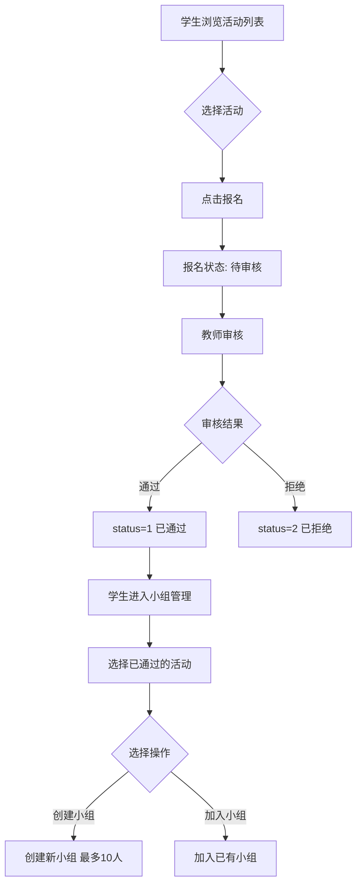

# 学生社会实践管理系统

[](https://www.oracle.com/java/)
[](https://spring.io/)
[](https://mybatis.org/)
[](https://www.mysql.com/)
[](LICENSE)

基于SSM框架（Spring + Spring MVC + MyBatis）开发的学生社会实践活动管理平台，支持学生、教师、管理员三种角色的协同工作。

## 📋 项目简介

本系统旨在为高校社会实践活动提供一站式信息化管理解决方案，涵盖活动发布、学生报名、小组管理、日常任务跟踪、实践报告提交、成绩评定等核心功能，支持多教师协同评分、权限分级管理、系统操作日志等特性。

### ✨ 核心特性

- 🔐 **三级权限管理**：管理员、教师、学生角色分离，权限控制精细化
- 👥 **多教师协同**：支持多位教师共同负责一个活动，协同评分取平均值
- 📊 **智能评分系统**：多教师评分自动计算平均分，支持教师评语
- 🏆 **小组实践模式**：支持学生组队参与活动（最多10人/组）
- 📝 **报告审核流程**：学生提交实践报告，教师在线审核并给出反馈
- 📢 **公告通知系统**：管理员发布系统公告，教师学生实时查看
- 📈 **数据统计分析**：活动参与统计、成绩汇总、学生表现数据可视化
- 🔍 **系统操作日志**：记录用户操作轨迹，便于审计和问题追溯
- 📤 **数据导入导出**：支持Excel批量导入学生/教师信息，数据导出备份

## 🛠️ 技术栈

| 技术组件 | 版本 | 说明 |
|---------|------|------|
| Java | 11 | 开发语言 |
| Spring | 5.2.9.RELEASE | IoC容器、事务管理、依赖注入 |
| Spring MVC | 5.2.9.RELEASE | Web MVC框架、RESTful API |
| MyBatis | 3.5.6 | ORM持久层框架 |
| MyBatis-Spring | 1.3.2 | Spring与MyBatis整合 |
| MySQL | 8.0.33 | 关系型数据库 |
| Druid | 1.2.8 | 高性能数据库连接池 |
| Tomcat | 9.0.50 (内嵌) | Web服务器 |
| JSP + JSTL | 1.2.6 | 视图层模板引擎 |
| Jackson | 2.12.3 | JSON序列化/反序列化 |
| Log4j | 1.2.17 | 日志框架 |
| Commons FileUpload | 1.4 | 文件上传支持 |
| Maven | 3.6+ | 项目构建管理 |

## 📦 系统功能

### 角色权限体系

| 角色 | 主要权限 |
|------|---------|
| **管理员** (admin) | 用户管理（学生/教师增删改查）<br/>活动管理（全部活动管理）<br/>公告管理（发布系统公告）<br/>系统日志（查看操作日志）<br/>数据导入导出 |
| **教师** (teacher) | 发布活动（支持多教师负责）<br/>审核报名（通过/拒绝学生报名）<br/>报名管理（查看报名学生、查看小组）<br/>审核报告（给出反馈意见）<br/>成绩评定（多人评分取平均）<br/>查看日常任务 |
| **学生** (student) | 浏览活动（可报名活动）<br/>报名参加（改选/退选）<br/>小组管理（创建/加入小组）<br/>日常任务（提交任务完成情况）<br/>实践报告（上传文件、提交报告）<br/>查看成绩（已结束活动成绩和评语） |

### 核心功能模块

#### 1️⃣ 用户与权限管理
- ✅ 用户注册（学生/教师角色选择）
- ✅ 用户登录（基于Session的状态管理）
- ✅ 权限拦截器（AuthInterceptor）
- ✅ 管理员管理学生/教师信息（增删改查）
- ✅ 用户信息修改

#### 2️⃣ 活动管理
- ✅ 活动发布（设置活动名称、类型、时间、地点、人数限制）
- ✅ 多教师负责（支持选择多个指导老师）
- ✅ 活动状态管理（招募中/进行中/已结束）
- ✅ 活动编辑与删除
- ✅ 学生端活动浏览（只显示招募中/进行中且未满员的活动）
- ✅ 活动统计视图（报名人数、小组数、报告数）

#### 3️⃣ 报名与审核
- ✅ 学生在线报名
- ✅ 报名状态管理（待审核/已通过/已拒绝）
- ✅ 教师审核报名（只能审核招募中/进行中的活动）
- ✅ 学生改选/退选
- ✅ 报名信息查询

#### 4️⃣ 小组管理
- ✅ 创建小组（只有审核通过的学生可操作）
- ✅ 加入小组（最多10人/组）
- ✅ 退出小组
- ✅ 解散小组（仅组长权限）
- ✅ 查看小组成员详情（姓名、学号、性别、班级、联系方式）

#### 5️⃣ 日常任务管理
- ✅ 学生提交日常任务（关联活动选择）
- ✅ 任务内容记录
- ✅ 任务状态跟踪（待处理/已完成）
- ✅ 教师查看学生任务

#### 6️⃣ 实践报告管理
- ✅ 学生提交报告（支持文件上传）
- ✅ 教师审核报告
- ✅ 教师反馈意见（推送给学生）
- ✅ 报告状态管理（待审核/已审核）
- ✅ 报告查询与管理

#### 7️⃣ 成绩评定系统
- ✅ 多教师评分（每位教师独立评分）
- ✅ 平均分计算（自动计算多位教师的平均分）
- ✅ 教师评语（评分时可添加评语）
- ✅ 学生查看成绩（已结束活动的成绩和评语）
- ✅ 成绩汇总视图（v_student_grade_summary）

#### 8️⃣ 公告系统
- ✅ 管理员发布公告
- ✅ 公告状态管理（草稿/已发布）
- ✅ 教师/学生首页显示最新公告
- ✅ 公告详情查看

#### 9️⃣ 系统日志
- ✅ 操作日志记录（LogInterceptor自动记录）
- ✅ 用户操作追踪（用户ID、用户名、操作、IP地址、时间）
- ✅ 日志查询与筛选
- ✅ 批量删除日志

#### 🔟 数据导入导出
- ✅ Excel导入学生信息
- ✅ Excel导入教师信息
- ✅ 数据导出备份

## 🚀 快速开始

### 环境要求

- ✅ JDK 11 或更高版本
- ✅ MySQL 8.0 或更高版本
- ✅ Maven 3.6 或更高版本
- ✅ 操作系统: Windows / Linux / macOS

### 1. 克隆项目

```bash
git clone <项目地址>
cd SocialPractice
```

### 2. 配置数据库

#### 2.1 创建数据库并导入数据

使用MySQL客户端执行项目根目录下的 `db_sql.sql` 文件（包含表结构、视图、初始数据和测试数据）：

```bash
mysql -u root -p < db_sql.sql
```

或在MySQL客户端中执行：

```sql
SOURCE /path/to/SocialPractice/db_sql.sql;
```

#### 2.2 修改数据库连接配置

编辑 `src/main/resources/jdbc.properties` 文件：

```properties
jdbc.driver=com.mysql.cj.jdbc.Driver
jdbc.url=jdbc:mysql://localhost:3306/student_practice?useUnicode=true&characterEncoding=utf-8&serverTimezone=Asia/Shanghai&useSSL=false&allowPublicKeyRetrieval=true
jdbc.username=root
jdbc.password=你的数据库密码
```

### 3. 编译项目

```bash
mvn clean compile
```

### 4. 运行项目

```bash
java -cp target/classes:lib/* com.ssm.Application
```

或使用IDE（如IntelliJ IDEA）直接运行 `com.ssm.Application` 类。

### 5. 访问系统

打开浏览器访问：**http://localhost:8080**

## 🔑 测试账号

| 角色 | 用户名 | 密码 | 说明 |
|------|--------|------|------|
| 管理员 | admin | 123456 | 系统管理员 |
| 教师 | teacher1 | 123456 | 张老师（计算机学院） |
| 教师 | teacher2 | 123456 | 李老师（计算机学院） |
| 教师 | teacher3 | 123456 | 王老师（计算机学院） |
| 教师 | teacher4 | 123456 | 赵老师（计算机学院） |
| 教师 | teacher5 | 123456 | 刘老师（计算机学院） |
| 学生 | student1 | 123456 | 小明（软件工程2024级2班） |
| 学生 | student2 | 123456 | 小红（软件工程2024级1班） |
| 学生 | student3 | 123456 | 小李（软件工程2024级2班） |
| 学生 | student4 | 123456 | 小王（软件工程2024级1班） |
| 学生 | student5 | 123456 | 小张（软件工程2024级2班） |
| ... | student6-15 | 123456 | 其他测试学生账号 |

## 📁 项目结构

```
SocialPractice/
├── src/
│   └── main/
│       ├── java/com/ssm/
│       │   ├── Application.java              # 应用启动入口（内嵌Tomcat）
│       │   ├── controller/                   # 控制器层（MVC-C）
│       │   │   ├── UserController.java       # 用户管理
│       │   │   ├── ActivityController.java   # 活动管理
│       │   │   ├── StudentActivityController.java  # 报名管理
│       │   │   ├── GroupController.java      # 小组管理
│       │   │   ├── DailyTaskController.java  # 日常任务
│       │   │   ├── PracticeReportController.java  # 实践报告
│       │   │   ├── GradeInfoController.java  # 成绩评定
│       │   │   ├── NoticeController.java     # 公告管理
│       │   │   ├── SystemLogController.java  # 系统日志
│       │   │   ├── StudentController.java    # 学生管理
│       │   │   ├── TeacherController.java    # 教师管理
│       │   │   ├── HomeController.java       # 首页控制
│       │   │   └── ImportExportController.java  # 数据导入导出
│       │   ├── service/                      # 服务层接口
│       │   │   └── impl/                     # 服务层实现
│       │   ├── dao/                          # 数据访问层接口（DAO）
│       │   ├── entity/                       # 实体类（POJO）
│       │   │   ├── User.java                 # 用户实体
│       │   │   ├── Teacher.java              # 教师实体
│       │   │   ├── Student.java              # 学生实体
│       │   │   ├── PracticeActivity.java     # 活动实体
│       │   │   ├── StudentActivity.java      # 报名实体
│       │   │   ├── GroupInfo.java            # 小组实体
│       │   │   ├── DailyTask.java            # 任务实体
│       │   │   ├── PracticeReport.java       # 报告实体
│       │   │   ├── GradeInfo.java            # 成绩实体
│       │   │   ├── Notice.java               # 公告实体
│       │   │   └── SystemLog.java            # 日志实体
│       │   ├── interceptor/                  # 拦截器
│       │   │   ├── AuthInterceptor.java      # 权限拦截器
│       │   │   └── LogInterceptor.java       # 日志拦截器
│       │   └── utils/                        # 工具类
│       │       ├── ExcelUtil.java            # Excel导入导出工具
│       │       └── PermissionUtil.java       # 权限判断工具
│       ├── resources/
│       │   ├── applicationContext.xml        # Spring核心配置
│       │   ├── springmvc.xml                 # Spring MVC配置
│       │   ├── mybatis-config.xml            # MyBatis配置
│       │   ├── jdbc.properties               # 数据库连接配置
│       │   ├── log4j.properties              # 日志配置
│       │   └── mapper/                       # MyBatis XML映射文件
│       │       ├── UserMapper.xml
│       │       ├── TeacherMapper.xml
│       │       ├── StudentMapper.xml
│       │       ├── PracticeActivityMapper.xml
│       │       ├── StudentActivityMapper.xml
│       │       ├── GroupInfoMapper.xml
│       │       ├── DailyTaskMapper.xml
│       │       ├── PracticeReportMapper.xml
│       │       ├── GradeInfoMapper.xml
│       │       ├── NoticeMapper.xml
│       │       ├── SystemLogMapper.xml
│       │       └── ActivityTeacherMapper.xml
│       └── webapp/
│           └── WEB-INF/
│               ├── views/                    # JSP视图文件
│               │   ├── index.jsp             # 系统首页
│               │   ├── login.jsp             # 登录页面
│               │   ├── register.jsp          # 注册页面
│               │   ├── admin/                # 管理员视图
│               │   │   └── index.jsp
│               │   ├── teacher/              # 教师视图
│               │   │   ├── index.jsp
│               │   │   └── ...
│               │   ├── student/              # 学生视图
│               │   │   ├── index.jsp
│               │   │   ├── list.jsp
│               │   │   └── ...
│               │   ├── activity/             # 活动视图
│               │   │   ├── list.jsp
│               │   │   ├── add.jsp
│               │   │   ├── edit.jsp
│               │   │   ├── detail.jsp
│               │   │   └── student_list.jsp
│               │   ├── studentActivity/      # 报名视图
│               │   ├── group/                # 小组视图
│               │   ├── dailyTask/            # 任务视图
│               │   ├── report/               # 报告视图
│               │   ├── grade/                # 成绩视图
│               │   ├── notice/               # 公告视图
│               │   ├── system/               # 系统管理视图
│               │   └── error/                # 错误页面
│               └── web.xml                   # Web应用配置
├── lib/                                      # 依赖jar包
├── db_sql.sql                                # 数据库完整脚本（包含测试数据）
├── db_schema.sql                             # 数据库表结构脚本（旧）
├── test_data.sql                             # 测试数据脚本（旧）
├── pom.xml                                   # Maven项目配置
├── README.md                                 # 项目说明文档
├── API.md                                    # API接口文档
├── DEPLOYMENT.md                             # 部署指南
├── CHANGELOG.md                              # 版本更新日志
├── PROJECT_REPORT.md                         # 项目报告
└── LICENSE                                   # 开源协议
```

## 🔄 业务流程

### 1. 学生报名与小组创建流程



### 2. 实践报告提交与审核流程

```
学生 → 选择已参加活动 → 编写报告内容 → 上传附件文件 → 提交报告(status=pending)
                                                        ↓
教师 → 查看待审核报告 → 阅读报告内容 → 给出反馈意见 → 标记为已审核(status=reviewed)
                                                        ↓
学生 → 查看报告状态 → 查看教师反馈
```

### 3. 多教师评分流程

```
活动结束 → 多位教师分别评分
            ↓
      教师1: 90分, 评语A
      教师2: 88分, 评语B
      教师3: 92分, 评语C
            ↓
    系统自动计算平均分: (90+88+92)/3 = 90.0分
            ↓
    学生查看成绩: 平均分90.0, 三位教师评语
```

## 📊 数据库设计

### 核心数据表（12张）

1. **user** - 用户表（存储所有用户基本信息）
2. **teacher** - 教师表（教师扩展信息）
3. **student** - 学生表（学生扩展信息）
4. **practice_activity** - 实践活动表
5. **activity_teacher** - 活动-教师关联表（支持多教师）
6. **student_activity** - 学生报名表
7. **group_info** - 小组信息表
8. **daily_task** - 日常任务表
9. **practice_report** - 实践报告表
10. **grade_info** - 成绩信息表（支持多教师评分）
11. **notice** - 公告表
12. **system_log** - 系统日志表

### 数据库视图（2个）

1. **v_student_grade_summary** - 学生成绩汇总视图（多教师评分取平均）
2. **v_activity_statistics** - 活动参与统计视图

详细的表结构请参考 `db_sql.sql` 文件。

## 🔌 API 接口

详细的API接口文档请参考 [API.md](API.md)。

### 主要接口分类

- **用户管理**: 登录、注册、登出、信息修改
- **活动管理**: 活动CRUD、活动列表、活动详情
- **报名管理**: 报名、取消报名、审核报名
- **小组管理**: 创建、加入、退出、解散小组
- **任务管理**: 提交任务、查看任务
- **报告管理**: 提交报告、审核报告
- **成绩管理**: 评分、查看成绩
- **公告管理**: 发布公告、查看公告
- **日志管理**: 查看日志、删除日志

## ❓ 常见问题

### Q1: 启动时报错 "Result Maps collection already contains value"

**原因**: MyBatis的Mapper XML文件中存在重复的resultMap定义。

**解决方案**: 
- 检查mapper目录下是否有重复的XML文件
- 确保每个Mapper接口只有一个对应的XML文件
- 检查resultMap的id是否在同一namespace中重复

### Q2: 数据库连接失败

**解决方案**:
1. 确认MySQL服务已启动
2. 检查 `jdbc.properties` 中的用户名和密码
3. 确认数据库名称为 `student_practice`
4. 检查MySQL的端口号（默认3306）
5. 如果使用MySQL 8.0，确保使用了正确的驱动类 `com.mysql.cj.jdbc.Driver`

### Q3: 端口8080被占用

**解决方案**:
1. 关闭占用8080端口的程序
2. 或修改 `Application.java` 中的端口配置：
   ```java
   tomcat.setPort(8081); // 修改为其他端口
   ```

### Q4: 学生无法创建小组

**原因**: 学生必须先报名活动并通过教师审核。

**解决方案**:
1. 确认学生已报名活动
2. 确认教师已审核通过（status=1）
3. 只有审核通过的学生才能创建或加入小组

### Q5: 成绩显示为空

**原因**: 只有已结束的活动且教师已评分才会显示成绩。

**解决方案**:
1. 确认活动状态为"finished"（已结束）
2. 确认教师已对该学生评分
3. 检查grade_info表中是否有对应记录

### Q6: 文件上传失败

**解决方案**:
1. 确认上传文件大小不超过限制
2. 检查 `uploads` 目录是否存在且有写权限
3. 检查 `springmvc.xml` 中的文件上传配置

## 🔧 开发指南

### 添加新功能

1. **创建实体类** (`entity` 包)
   ```java
   public class NewEntity {
       private Integer id;
       private String name;
       // getters and setters
   }
   ```

2. **创建DAO接口** (`dao` 包)
   ```java
   public interface NewEntityDAO {
       List<NewEntity> findAll();
       NewEntity findById(Integer id);
       int insert(NewEntity entity);
   }
   ```

3. **创建Mapper XML** (`mapper` 目录)
   ```xml
   <mapper namespace="com.ssm.dao.NewEntityDAO">
       <resultMap id="NewEntityResultMap" type="com.ssm.entity.NewEntity">
           <id column="id" property="id"/>
           <result column="name" property="name"/>
       </resultMap>
   </mapper>
   ```

4. **创建Service** (`service` 包及 `impl` 子包)

5. **创建Controller** (`controller` 包)

6. **创建JSP视图** (`views` 目录)

### 代码规范

- 📖 遵循阿里巴巴Java开发规范
- 🎯 Controller层只做请求转发，业务逻辑放在Service层
- 🔄 使用 `@Transactional` 注解管理数据库事务
- 📝 重要方法添加注释说明
- ✅ 统一异常处理
- 🔒 敏感操作需要权限验证

### 权限控制

系统使用拦截器进行权限控制：

```java
// AuthInterceptor.java
// 根据URL和用户角色进行权限判断
if (uri.startsWith("/admin/") && !"admin".equals(role)) {
    response.sendRedirect("/index");
    return false;
}
```

### 日志记录

系统使用LogInterceptor自动记录用户操作：

```java
// LogInterceptor.java
// 自动记录用户操作到system_log表
SystemLog log = new SystemLog();
log.setUserId(user.getUserId());
log.setUsername(user.getUsername());
log.setOperation(operation);
log.setIp(getClientIP(request));
```

## 📝 版本历史

| 版本 | 日期 | 更新内容 |
|------|------|--------|
| v2.0.0 | 2024-12-13 | 完善所有功能模块，支持多教师协同评分、公告系统、系统日志 |
| v1.0.1 | 2024-12-13 | 修复注册功能、表单字段映射、HTML语法错误 |
| v1.0.0 | 2024-12-12 | 初始版本，实现基础功能 |

## 📄 相关文档

- [API接口文档](API.md)
- [部署指南](DEPLOYMENT.md)
- [项目报告](PROJECT_REPORT.md)
- [更新日志](CHANGELOG.md)
- [贡献指南](CONTRIBUTING.md)

## 📜 开源协议

本项目采用 [MIT License](LICENSE) 开源协议。

## 👨‍💻 贡献者

感谢所有为本项目做出贡献的开发者！

## 📧 联系方式

如有问题或建议，欢迎通过以下方式联系：

- 提交 [Issue](https://github.com/your-repo/issues)
- 发送邮件至: your-email@example.com

---

**⭐ 如果这个项目对你有帮助，请给个Star支持一下！**
